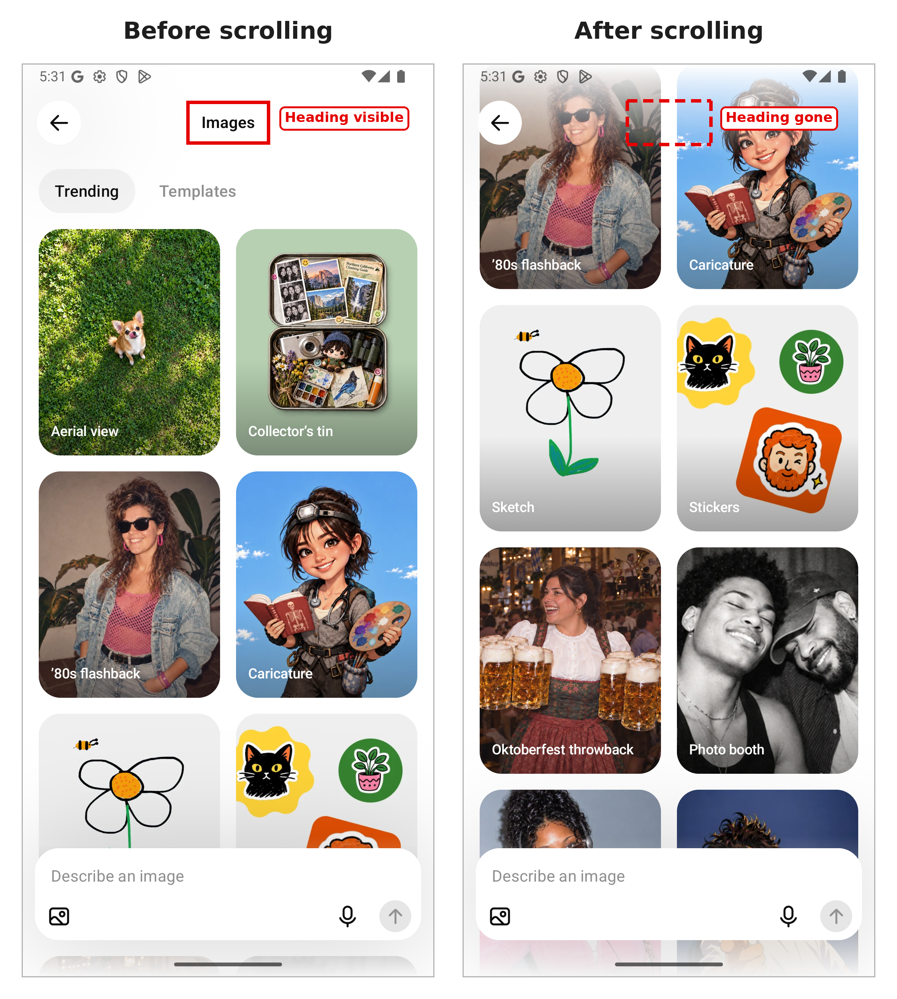

# Category 3: Clear Navigation Location

**Description:** Headers and/or navigation bars are present to help maintain continuous awareness of the position within the application interface.

- **Applicable SCs:** SC 2.4.2, SC 2.4.6, SC 2.4.8
- **Applicable DPs:** DP 4.2.1, DP 4.2.4, DP 4.2.7, DP 4.3.1, DP 4.3.3
- **Affected Elements:** Headers, sub-headers, and navigation bars

---

## Issue 3.1: Missing View Identifier

**Issue Characterization:** Manifests when users navigate to a new view within the application without encountering positional indicators that communicate their current location within the interface.

**Illustrative Example:**

*Figure 3.1. TODO: When adding a new course to learn in Duolingo a serious of screens are prompted asking the user what would they like to learn, their current level, among other things. However, these view do not have a header than can learn the user know that what they are currenlty doing is adding a new course to learn.*

---

## Issue 3.2: Disappearing View Identifier

**Issue Characterization:** Occurs when a view initially presents a positional indicator, yet this indicator becomes obscured or ceases to be visible following user interactions, particularly during scrolling operations.

**Illustrative Example:**

*Figure 3.2. When using trying ChatGPT to create images, when the user first enter the view it has a header and a filter tab to let them know what templates are they currently observing. However, after scrolling to see more of the templates both the heading and the filter tab disappear.
