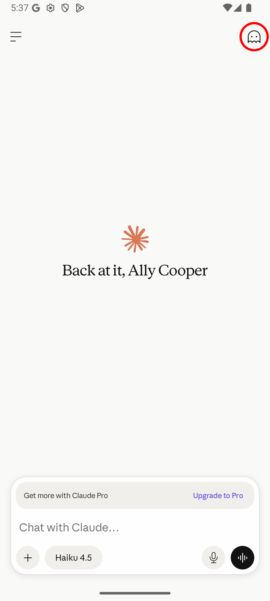
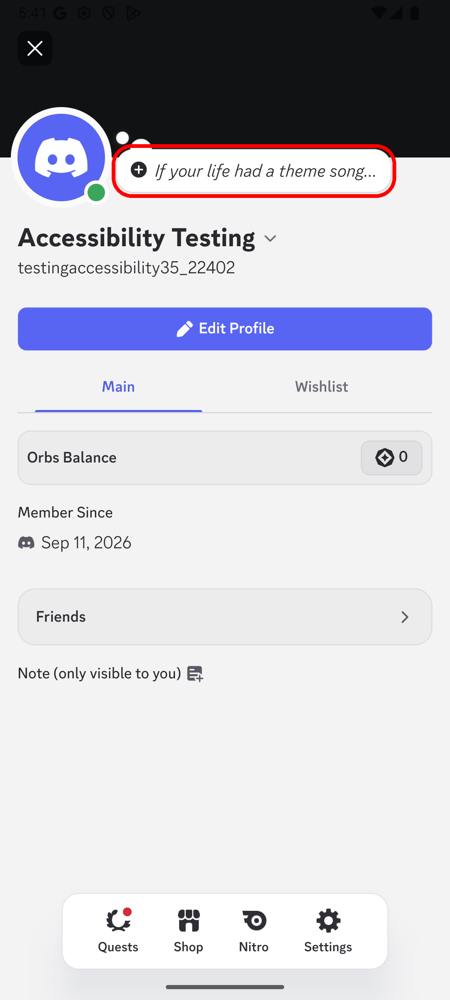

# Category 1: Clear Actionable Element Purpose

**Description:** Interactive components within mobile applications have explicit purpose clarity.

- **Applicable SCs:** SC 1.3.5, SC 1.3.6, SC 3.2.4, SC 3.3.2
- **Applicable DPs:** DP 4.2.1, DP 4.2.3, DP 4.2.4, DP 4.2.7, DP 4.3.1, DP 4.5.4, DP 4.5.6, DP 4.5.7
- **Affected Elements:** Input forms, buttons, and icons

---

## Issue 1.1: Missing Purpose

**Issue Characterization:** Any interface component lacking any discernible label, placeholder, or accompanying text that would enable users to comprehend the anticipated input or corresponding action upon interaction.

**Illustrative Example:**

*Figure 1.1. In the Claude application there is a ghost icon which opens an incognito chat when clicked, however its meaning is not universally known.*

---

## Issue 1.2: Unclear Purpose

**Issue Characterization:** Components whose visible label, placeholder, or textual content proves insufficient to adequately communicate the expected input or action to the user.

**Illustrative Example:**

*Figure 1.2. In the Discord profile, an user can add a note for others to see, however, this note just provides an example of a possible topic that can be added, it does not let the user know that the note can be about anything they want, not just the prompt that appears as placeholder.*
