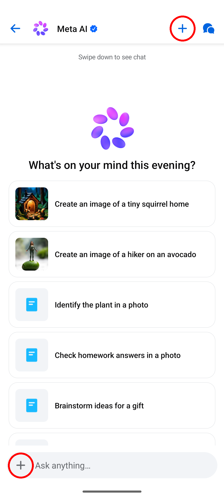
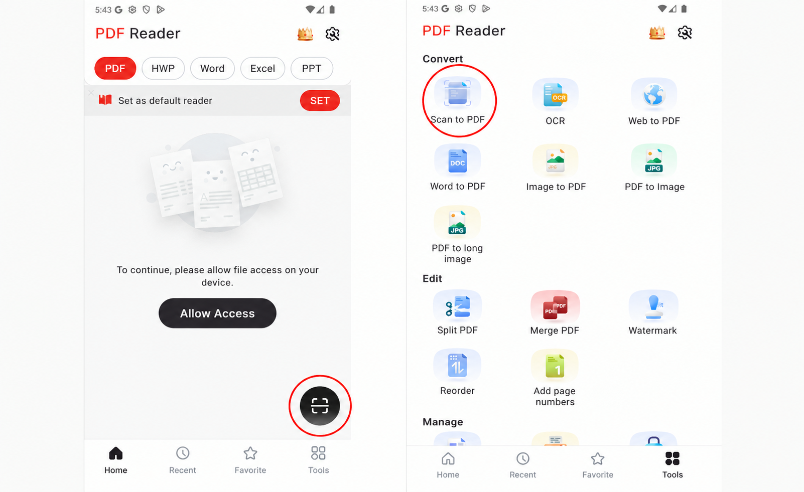

# Category 2: Consistent Actionable Element Functionality

**Description:** The operational characteristics of interactive components are consistent throughout the mobile application.

- **Applicable SCs:** SC 3.2.4
- **Applicable DPs:** DP 4.2.3
- **Affected Elements:** Buttons and icons

---

## Issue 2.1: Same Appearance, Inconsistent Functionality

**Issue Characterization:** Examines buttons or icons that maintain visual uniformity while producing different operational outcomes upon user interaction within the application.

**Illustrative Example:**

*Figure 2.1. In the Messenger app when starting a chat with Meta AI the user can see two different plus sign icons on the screen. The same-looking element produces different outcomes, while the one on the top creates a new chat, the one on the bottom lets the user generate an AI image.*

---

## Issue 2.2: Same Functionality, Inconsistent Appearance

**Issue Characterization:** Evaluates buttons or icons that execute identical operations despite exhibiting visual dissimilarity from one another.

**Illustrative Example:**

*Figure 2.2. In the PDF Reader application a document can be scan to convert into a PDF from two different locations within the application, however, both location display different actionables elements to perform such operation.*
